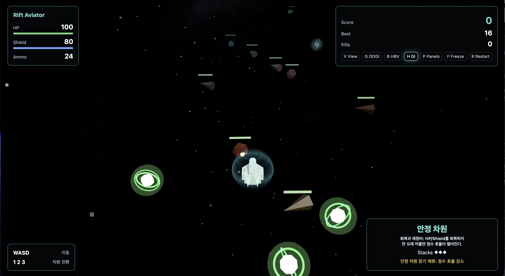
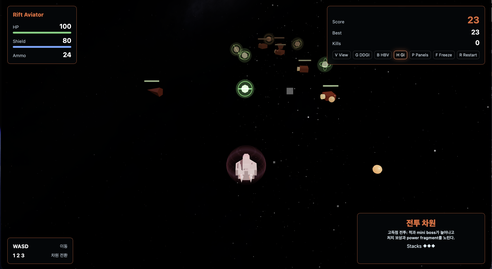
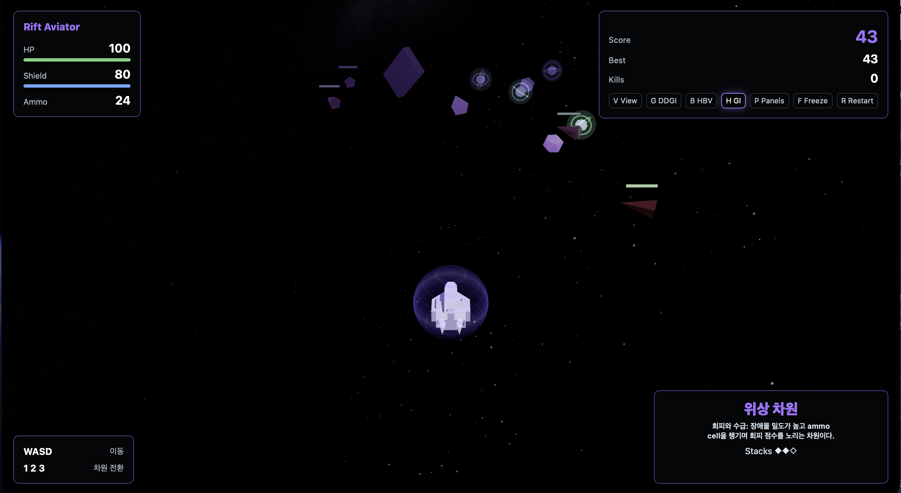
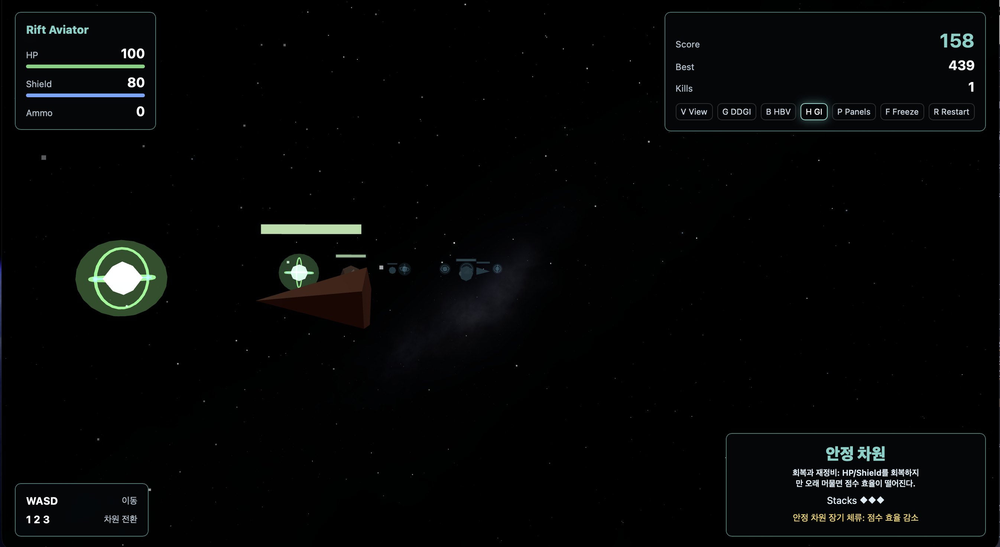
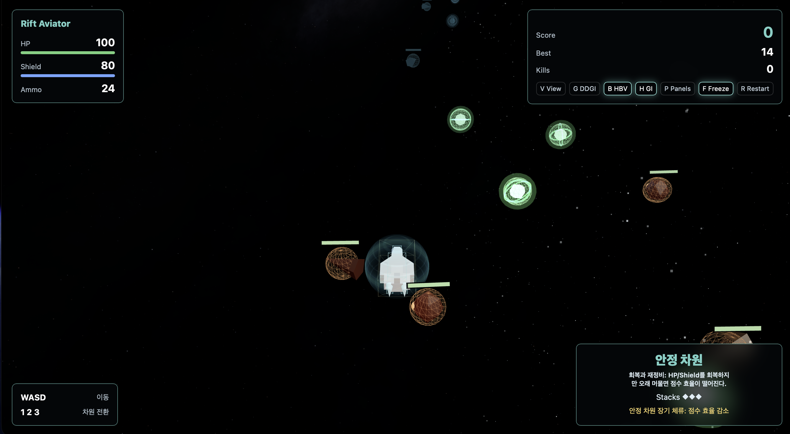
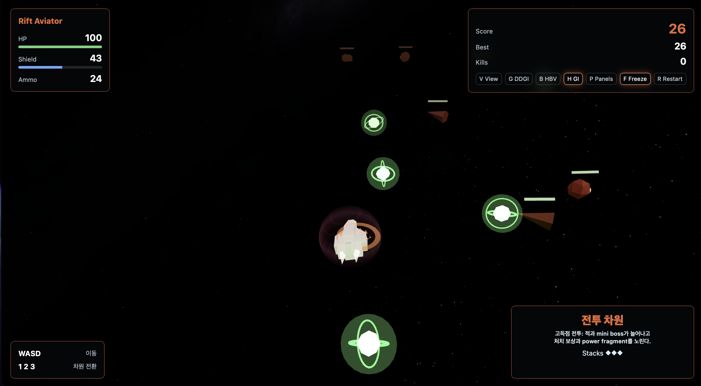

# Rift Aviator: Dimension Shift

게임 링크: [클릭하여 이동](https://leehyowon14.github.io/CG-final/)

## 1. 프로젝트 소개

`Rift Aviator: Dimension Shift`는 기존 TheAviator라는 Three.js 웹 게임을 바탕으로, Vite+ES modules 구조에 맞춰 최신화하고 다시 구성한 게임이다. 플레이어는 SF 우주선을 조종하며 안정, 전투, 위상 차원을 오가고 생존, 적 처치, 장애물 회피, 아이템 획득으로 점수를 얻을 수 있다.

원본 비행 게임의 캐주얼한 정면 시점과 구식 JavaScript 구조는 대각선 탑다운 3D 슈팅, 현대식 시스템 모듈, 차원 전환 gameplay로 바꿨다. 그래픽은 금속 우주선, 차원색 emissive core, 우주 배경, 포탈 균열, DDGI-inspired 간접광 근사를 중심으로 구성했다.

> 보고서 내 사진이 디테일이 부족할 경우, 클릭하여 확대해서 보시길 권장드립니다.

| 변경 항목 | 기존 프로젝트      | 해당 프로젝트                              |
| --------- | ------------------ | ------------------------------------------ |
| 시점      | 정면/캐주얼 비행   | 대각선 탑다운, 1인칭, chase view, top view |
| 조작      | 마우스 커서로 비행 | WASD 이동, Space 발사, 1/2/3 차원 전환     |
| 스타일    | 비행기/바다/구름   | 저폴리 SF, 차원 균열, 우주선               |
| 구조      | 전역 JS            | Vite + Three.js + ES modules               |
| 조명      | 단일 조명          | 차원별 조명, HDR environment, DDGI 근사    |

## 2. 게임

핵심 플레이는 세 차원을 오가며 서로 다른 보상과 위험을 관리하는 데 있다. 한 차원에만 머무르면 고득점이 어렵기 때문에 차원 스택과 ammo, HP, Shield를 함께 관리해야 한다.

|                     안정 차원                     |                     전투 차원                     |                     위상 차원                     |
| :-----------------------------------------------: | :-----------------------------------------------: | :-----------------------------------------------: |
|  |  |  |

| 차원      | 역할             | 보상                         | 위험                                |
| --------- | ---------------- | ---------------------------- | ----------------------------------- |
| 안정 차원 | 회복과 재정비    | HP/Shield 회복               | 오래 머무르면 점수 효율 저하        |
| 전투 차원 | 고득점 전투      | 적 처치 점수, Power Fragment | 적 스폰 증가, Mini Boss             |
| 위상 차원 | 자원 수급과 회피 | Ammo Cell, 회피 점수         | Rift Crystal, Phase Wall, Rift Mine |

플레이 루프는 다음 순서로 설계했다.

1. 안정 차원에서 HP와 Shield를 회복한다.
2. 전투 차원으로 이동해 적과 mini boss를 상대하며 높은 점수를 얻는다.
3. 위상 차원에서 장애물을 회피하고 ammo cell을 챙긴다.
4. 차원 스택과 쿨타임을 관리하며 다시 전투 차원으로 복귀한다.

|                      이동과 회피                       |                     Space 발사                     |                 총알 0 발사 차단                 |
| :----------------------------------------------------: | :------------------------------------------------: | :----------------------------------------------: |
|  |  |  |

## 3. 조작과 카메라

| 입력            | 기능                                              |
| --------------- | ------------------------------------------------- |
| `W` / `S`       | 월드 상대 이동 속도 변경을 통한 우주선 속도 조절  |
| `A` / `D`       | X축 회피 이동                                     |
| `Space`         | 탄환 발사, ammo 소모                              |
| `1` / `2` / `3` | 안정/전투/위상 차원 전환 요청                     |
| `V`             | 기본, 1인칭, 후방 추적, 탑뷰 순환                 |
| `G`             | DDGI probe debug visualization 토글               |
| `H`             | GI on/off 토글                                    |
| `B`             | 플레이어 HBV와 object collision bounds debug 토글 |
| `P`             | DDGI receiver panel 표시 토글                     |
| `F`             | gameplay와 DDGI tracing freeze 토글               |
| `R`             | restart                                           |

플레이어 우주선의 Z 위치는 화면 안 기준점에 고정된다. W/S 입력은 우주선 자체를 끝없이 전진시키지 않고 차원 필드, 포탈, 적, 장애물, 아이템의 상대 이동 속도를 바꾼다. 덕분에 플레이어가 화면 밖으로 이탈하지 않으면서도 앞으로 가는 것 처럼 느끼게 했다.

우주선 자세는 입력 속도에서 목표 pitch/roll을 만들고 quaternion으로 변환한 뒤 `Quaternion.slerp`로 보간한다. Euler 값을 직접 선형 보간하지 않으므로 좌우 회피와 전후 가속의 자세 변화가 부드럽다.

|                  기본 대각선 뷰                  |                    1인칭 뷰                    |                   후방 추적 뷰                    |                      탑뷰                      |
| :----------------------------------------------: | :--------------------------------------------: | :-----------------------------------------------: | :--------------------------------------------: |
|  |  |  |  |

## 4. 개발 구조

프로젝트는 정적 웹 게임으로 배포할 수 있도록 Vite를 사용한다. `src/core/Game.js`가 전체 loop를 관리하고 렌더링과 게임 규칙은 역할별 시스템으로 분리했다.

| 영역        | 주요 파일                                                                                         | 설명                                                                          |
| ----------- | ------------------------------------------------------------------------------------------------- | ----------------------------------------------------------------------------- |
| game loop   | `src/core/Game.js`                                                                                | 입력, 상태 갱신, 시스템 update, render 호출                                   |
| scene setup | `src/scene/SceneSetup.js`                                                                         | scene, fog, perspective camera, WebGL renderer, tone mapping, shadow map 설정 |
| player      | `src/entities/PlayerShip.js`, `src/gfx/ModelFactory.js`                                           | 우주선, shield, emissive, 자세 보간                                           |
| dimension   | `src/systems/DimensionManager.js`, `src/systems/DimensionRiftSystem.js`                           | 차원 스택, 포탈 생성, 통과 후 상태 변경                                       |
| combat      | `src/systems/EnemySystem.js`, `src/systems/ProjectileSystem.js`, `src/systems/CollisionSystem.js` | 적 스폰, 탄환, 충돌, 점수                                                     |
| GI          | `src/systems/DDGIManager.js`                                                                      | DDGI-inspired probe grid와 shader patch                                       |
| QA          | `scripts/visual-qa.mjs`                                                                           | 실제 브라우저 입력, canvas, console, GI/HBV toggle 검증                       |

이 프로젝트의 월드 좌표계는 X축을 좌우 회피, Y축을 높이, Z축을 진행 방향으로 둔다. 플레이어 우주선은 화면 안 기준 Z 위치에 고정하고 W/S 입력으로 우주선의 Z 좌표가 아니라 주변 오브젝트와 차원 필드의 상대 이동 속도를 바꾼다. 플레이어는 화면 밖으로 밀려나지 않으면서도 월드가 앞으로 흐르는 전진감을 얻는다.

rotation 파트에서 학습한 quaternion 보간은 우주선의 자세 변화에 사용했다. A/D와 W/S 입력에서 목표 pitch와 roll을 만들고 Euler 값을 직접 선형 보간하지 않은 채 quaternion으로 변환한 뒤 `Quaternion.slerp`로 보간한다. `Quaternion.slerp` 보간 덕분에 방향을 바꿀 때 우주선이 갑자기 꺾이지 않고 현재 자세에서 목표 자세로 자연스럽게 회전한다. 카메라도 같은 원리로 위치와 up vector를 부드럽게 따라가도록 만들었다.

차원별 분위기와 우주선 표면에는 shading과 lighting 파트에서 다룬 ambient/direct light와 material response 개념을 반영했다. 안정 차원은 청록색, 전투 차원은 붉은색/주황색, 위상 차원은 보라색 계열로 ambient, key, fill, rim light를 바꾼다. 플레이어 우주선은 Kenney OBJ material을 보강하고 별도 차원색 emissive를 더해 차원 상태를 표현했다. fallback 모델에서는 hull, canopy, core material을 분리해 같은 시각 구조를 유지한다. Shield는 normal과 view direction의 내적으로 Fresnel rim을 계산해 가장자리가 더 강하게 빛나도록 했다.

|                       쉴드와 우주선                        |                  전투 차원 조명                   |                 차원문 transparency                  |
| :--------------------------------------------------------: | :-----------------------------------------------: | :--------------------------------------------------: |
|  |  |  |

texture와 environment mapping 개념은 우주 배경과 금속 선체 반사에 사용했다. equirectangular 파일을 로드한 뒤 PMREM으로 변환해 `scene.environment`에 넣고 같은 이미지는 sky sphere shader에서 샘플링해 배경으로 사용했다. 그 결과 우주선의 금속 선체는 색상만 가진 물체가 아니라 주변 우주 환경의 반사를 받는 PBR material처럼 보여야 하지만 우주 배경 특성상 잘 보이지는 않는다.

포탈은 플레이어 앞에 생성된 뒤 `worldTravelSpeed` 보간으로 다가오고 이전 차원의 적/장애물/아이템/탄환은 fade out된다. 적 health bar는 카메라를 향하는 billboard transform으로 처리해 어느 시점에서도 전투 대상을 읽을 수 있게 했다. 피격 순간에는 같은 충돌 이벤트에서 우주선 flash, particle burst, camera shake를 발생시켜 gameplay feedback과 animation을 연결했다.

스폰 pacing은 원거리 생성과 근거리 보조 생성으로 나눴다. 일반 주행 중에는 적/장애물이 Z=168, pickup이 Z=156의 카메라 far plane 바깥에서 생성되어 서서히 접근한다. 시작 직후와 포탈 통과 직후에는 화면이 비지 않도록 Z=32 보조 스폰을 병행하고 멀리서 스폰된 오브젝트가 Z=32 선에 도달하면 보조 스폰을 중단한다. 근거리 스폰은 원거리 스폰을 대체하는 방식이 아니라 멀리서 생성된 오브젝트가 도착할 때까지 시간을 벌어주는 임시 보강이다.

스폰 설계의 기준은 pop-in과 pacing 사이의 균형이다. 모든 적/장애물/pickup을 가까운 곳에서만 만들면 플레이어 눈앞에 갑자기 나타나는 느낌이 강하다. 모두 멀리서만 만들면 시작 직후와 차원 전환 직후에 화면이 비어 게임이 멈춘 것처럼 보인다. 멀리서 수행되는 스폰은 자연스러운 접근감을 담당하고 가까이서 수행되는 스폰은 초기 공백을 메우는 보조 장치로만 둔다. 멀리서 소환된 오브젝트가 Z=32 선에 도착하면 가까이서 소환되지 않게 하는 이유도 같은 스폰 source가 계속 중복되어 난이도가 튀는 것을 막기 위해서다.

global illumination 파트의 direct/indirect light와 irradiance probe 개념은 DDGI-inspired probe grid가 담당한다. WebGL 환경에서는 하드웨어 ray tracing과 compute shader 기반 DDGI를 그대로 구현하기 어렵다. 이 제약 안에서 playable volume에 9 x 4 x 11 probe를 배치하고 각 probe의 L1 spherical harmonics coefficient와 visibility를 `DataTexture`에 저장했다. `MeshStandardMaterial`은 shader patch로 world position 기준 주변 probe를 삼선형 보간하고 surface normal 방향으로 SH 값을 평가해 indirect diffuse에 더한다. GI off/on 비교 화면에서는 같은 표면이 직접광만 받을 때와 probe 기반 간접광을 받을 때의 차이를 확인할 수 있다.

|                    DDGI ON                     |                    DDGI OFF                     |                   DDGI probe debug                   |
| :--------------------------------------------: | :---------------------------------------------: | :--------------------------------------------------: |
|  |  |  |

쉴드 버블은 `ShaderMaterial` fragment shader에서 normal과 view direction의 dot product로 Fresnel rim을 만든다. 포탈과 유리 파편은 투명도, alpha 변화, depth 처리, additive 성격의 시각 효과를 사용해 rasterization 결과에서 blending이 어떻게 보이는지 설명한다.

## 7. 차원 전환 Animation

차원 전환에서는 상태 변경과 시각 연출을 분리한다. 숫자키 입력이 들어오면 `DimensionManager`가 전환 요청을 만들고 `DimensionRiftSystem`이 우주선 앞에 수직 포탈, 균열, 유리 파편을 생성한다.

우주선은 화면 기준점을 유지한 채 `worldTravelSpeed`를 보간해 포탈과 월드가 다가오는 것처럼 보이게 한다. 포탈이 우주선 기준점을 지나면 그때 실제 차원이 변경된다. 차원 전환 시작 시 이전 차원의 적, 장애물, 아이템, 탄환은 fade out되고 통과 완료 시 정리된다.

## 8. Collision과 HBV

플레이어 피격 판정은 단순 구 하나로 처리하지 않고 Hierarchical Bounding Volume을 사용한다. broad-phase root box에서 먼저 후보를 걸러낸 뒤 hull, canopy, nose, side pod, engine box 등 하위 volume으로 실제 피격 여부를 판정한다.

`B` 키를 누르면 플레이어 HBV와 적/장애물/아이템/탄환의 collision bounds가 보인다. 이 debug visualization은 실제 피격 판정이 화면의 우주선보다 과하게 크지 않은지 확인하는 장치다.

|                  HBV debug                   |
| :------------------------------------------: |
|  |

충돌 결과는 HP/Shield 감소, 적 제거, 점수 증가, pickup 획득, camera shake, particle burst로 이어진다. 전투 대상에는 health bar billboard를 표시하고 장애물에는 표시하지 않아 같은 발광 오브젝트가 섞여도 플레이어가 빠르게 판단할 수 있다.

|                    적 충돌                    |
| :-------------------------------------------: |
|  |

## 9. DDGI-inspired Global Illumination

본 프로젝트는 완전한 DDGI를 구현하지 못했다. WebGL 환경에서는 하드웨어 ray tracing과 compute shader 기반 probe tracing을 사용할 수 없다. 이 한계 안에서 DDGI의 핵심 구조인 probe grid, irradiance accumulation, shader-side interpolation을 게임 성능에 맞춰 근사했다.

초기에는 Surfel GI도 후보였지만 최종 구현에서는 사용하지 않았다. Surfel GI는 바닥, 벽, 큰 정적 표면처럼 빛을 받을 표면 샘플이 분명한 장면을 설명하기 쉽지만 이 게임은 우주 공간을 배경으로 하고 적, pickup, 포탈 유리 파편, 우주선처럼 떠다니는 동적 오브젝트가 많다. 우주 공간 중심 장면에서는 특정 표면 위에 surfel을 배치하는 방식보다 playable volume 전체에 probe grid를 두고 world position과 normal로 간접광을 샘플링하는 방식이 더 적합하다고 판단했다. 특히 과제에서 보여주고 싶은 차이는 바닥/벽의 색 번짐보다 우주선과 포탈 주변 오브젝트가 probe field의 영향을 받는 장면이었기 때문에 DDGI-inspired probe grid를 선택했다.

`DDGIManager`는 playable volume 안에 9 x 4 x 11, 총 396개의 probe를 배치한다. 초기 버전은 probe별 RGB irradiance만 저장했다. 최신 구현에서는 각 probe에 L1 spherical harmonics coefficient 4개와 visibility를 저장한다. 각 coefficient와 visibility는 1D `DataTexture`에 기록된다. `MeshStandardMaterial`은 `onBeforeCompile` shader patch로 world position 기준 주변 probe를 삼선형 보간한다. fragment shader에서는 surface normal 방향으로 L1 SH를 평가한 뒤 그 결과를 `reflectedLight.indirectDiffuse`에 더한다.

probe update의 경우 `DDGIManager`는 scene을 순회하면서 GI contributor 후보를 모은 뒤 probe마다 거리와 intensity 기준 상위 4개 후보를 선택한다. 이후 probe에서 contributor 방향으로 `THREE.Raycaster`를 쏴 blocker가 없을 때만 contributor color를 방향성 SH coefficient로 주입한다. `THREE.Raycaster` visibility 검사로 포탈, 유리 파편, receiver panel, pickup처럼 주변에 있는 오브젝트 색이 probe debug 점과 GI on 화면에 약하게 반영된다.

contributor 방향 tracing은 unbiased ray tracing이 아니다. random ray를 대량으로 쏘지 않고 맞을 가능성이 높은 contributor 방향만 확인하며 396개 probe 전체를 매 프레임 tracing하지 않고 132 probes/frame budget으로 3프레임 안에 한 번씩 갱신한다. 그 대신 temporal accumulation과 weak diffusion을 적용해 갑작스러운 색 변화가 튀지 않도록 했다. visual QA처럼 안정적인 검증이 필요할 때는 `forceTraceAll` 옵션으로 전체 probe를 즉시 갱신한다.

progressive update 구조 때문에 빠르게 움직이는 초록색 pickup 주변에서는 약한 깜빡임처럼 보이는 순간이 있다. pickup은 scene light를 직접 만들지는 않지만 초록색 self-lit material과 자동 contributor 정책 때문에 주변 probe에 약하게 색을 주입한다. 모든 probe가 같은 프레임에 동시에 갱신되지 않으므로 pickup 근처의 일부 probe가 먼저 초록 기여를 반영하고 나머지 probe가 다음 프레임에 따라온다. 프레임별 반영 시점 차이로 미세한 temporal mismatch가 생긴다. 이 깜빡임은 구현 오류라기보다 WebGL에서 전체 probe를 매 프레임 tracing하지 않기로 한 성능 판단의 부작용이다.

|                   DDGI probe debug                   |                     GI off                      |                     GI on                      |
| :--------------------------------------------------: | :---------------------------------------------: | :--------------------------------------------: |
|  |  |  |

우주선은 DDGI receiver와 blocker로는 남기고 자동 contributor에서는 제외했다. self-feedback을 막기 위한 선택이다. 우주선 hull 전체를 contributor로 두면 receiver인 우주선 material 색이 다시 주변 probe에 주입되어 "우주선이 자기 자신을 비추는" 결과가 생긴다. 실제 RT DDGI라면 광원, 표면, visibility, history가 더 엄밀하게 분리되지만 이 WebGL 근사에서는 source와 receiver가 같은 dynamic object에 묶일 때 색 번짐이 과해진다. self-feedback을 피하려고 hull은 간접광을 받는 대상과 ray blocker로만 사용하고 나중에 engine glow가 필요하면 작은 emissive mesh에만 명시적 contributor를 붙이는 정책을 택했다.
